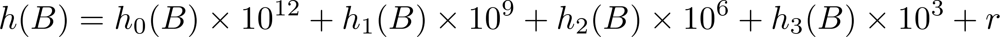

# Checkers AI for ECE469
Caleb Zulawski


## Requirements
This software was developed with ``gcc`` 4.9.2+ and ``make`` on Linux and Windows (using Cygwin).  Other C++11 compatible compilers and older versions of ``gcc`` may work but no guarantees.  Building in the Cygwin environment requires the ``mingw-pthreads`` package.  To play the game, you must be using a terminal emulator that supports ANSI color codes.

## Installing and running
To build and run:
```sh
git clone https://github.com/calebzulawski/checkers-ai.git
cd checkers-ai
make
./checkers-ai
```

To load a board state:
```sh
./checkers-ai /path/to/board/file
```

## Implementation details

### Board representation
The board is represented as a 32-bit bitboard.  This allows efficient access and copy mechanisms.  This also allows the use of the hamming distance (set bit count) functions on many processor architectures.

### AI
#### Search algorithm
The AI uses iterative deepening with alpha-beta pruning.  The search deepens by 2 every turn, which seems to provide slightly deeper searches, on average, than deepening by 1.  If the entire tree is explored, the iterative deepening will end.  To time the iterative deepening algorithm, a second thread is spawned that keeps track of the current time, ending the search early if the time reaches within 100ms of the maximum search time.

#### Heuristic function
The value of a board state is evaluated as a signed integer, with a higher value indicating a winning board.  The heuristic function contains several separate functions that evaluate the board state.  These functions are then weighted by importance:


h<sub>0</sub> counts the number of the maximizing player's pawns minus the number of the opponent's pawns, and multiplies this by 3.  It then adds the number of the maximizing player's kings minus the number of the opponent's kings, multiplied by 5.

h<sub>1</sub> is the number of the maximizing player's total pieces minus the opponent's total number of pieces.  This allows the AI to make more favorable trades when winning.

h<sub>2</sub> returns 0 if both players have more than 3 pieces.  Otherwise, it returns a higher value if the maximizing player's pieces are in near the double corners, and low if the opponent's pieces are there.  This is intended to help edge out a player holding the double corner.

h<sub>3</sub> promotes board advancement by returning the sum of the distance of the maximizing player's pieces to the other end of the board, minus the opponent's sum.  It also promotes keeping the back row occupied by weighing that higher.

r is a random value between 0 and 99, preventing the AI from making deterministic decisions in the case of ties.